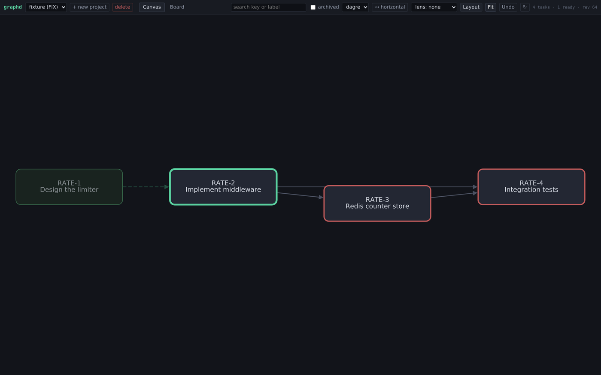
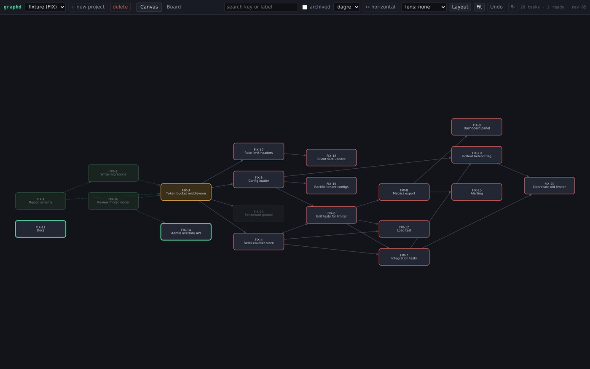
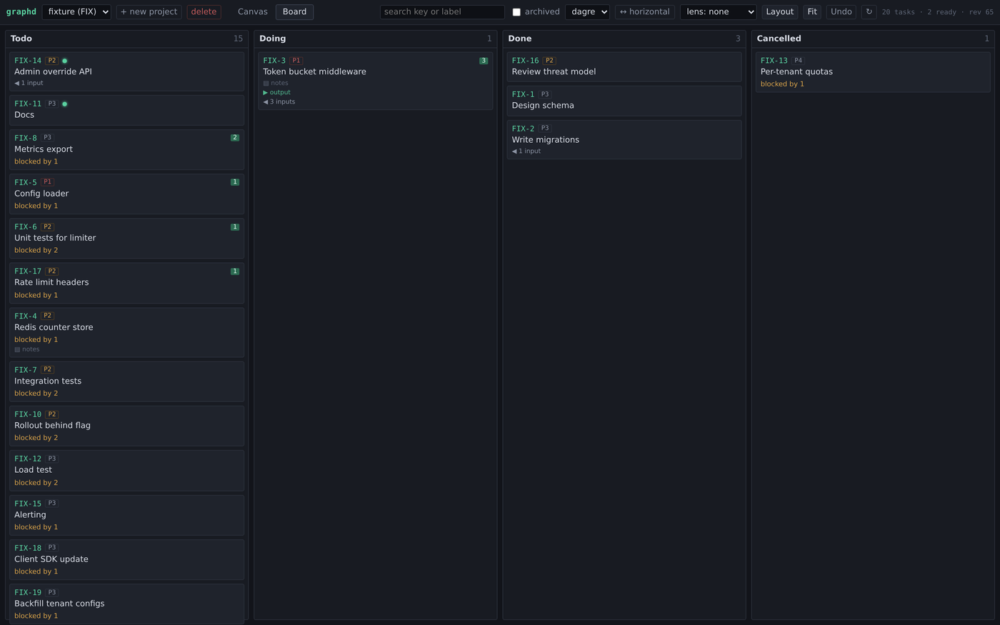
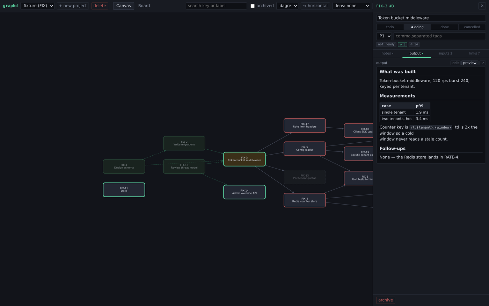

# graphd

**Hand an agent an idea; get back a project where every task's blockers are
explicit — then let any number of agents work it in parallel without stepping on
each other.**

graphd is a shared work graph. An agent decomposes a goal into tasks and
dependencies in one call; the graph shows a human exactly what is ready and what
blocks what; agents then claim frontier work, record what they produced, and the
next agent downstream picks up those results as its inputs. It is a local SQLite
file and one binary — no server, no account, no cloud.

---

## Why it exists

The usual loop — a model writes a plan into a doc, you paste it back in, you relay
the results by hand — breaks down as soon as the plan is bigger than one sitting.
Two things go wrong: the plan's *shape* (what blocks what) only ever lives in
prose, and there is nowhere for a finished piece of work to put its results where
the next piece will find them.

graphd makes both structural:

- **The plan is a graph.** Dependencies are edges, so "what can I start now" is a
  query, not a reading-comprehension exercise.
- **Results travel along the edges.** When a task finishes, its `output` becomes
  the `inputs` of the tasks it unblocks. No copying, no relaying.

And because the graph is shared state, several agents can work the same project at
once: they all ask the same question — *what is ready?* — and they all see the
same answers.

---

## What it looks like in practice

**One agent plans.** It calls `scaffold_plan` once with the tasks and the edges
between them. The whole plan lands atomically, or none of it does.

```jsonc
// scaffold_plan — 4 tasks, 4 dependencies, one transaction
{"project": "rate",
 "tasks": [
   {"ref": "a", "label": "Design the limiter",      "priority": 1},
   {"ref": "b", "label": "Implement middleware",    "priority": 1},
   {"ref": "c", "label": "Redis counter store",     "priority": 2},
   {"ref": "d", "label": "Integration tests",       "priority": 2}],
 "edges": [
   {"blocker": "a", "blocked": "b"},
   {"blocker": "b", "blocked": "c"},
   {"blocker": "b", "blocked": "d"},
   {"blocker": "c", "blocked": "d"}]}
```

**You look at it.** The whole plan, laid out — what is ready, what it unblocks,
what is still waiting on what.



You steer from here: drag nodes, add a blocker, split a task, reprioritise. Shaping
the graph is the job, not doing the work.

**Agents work it.** Any agent that wants work asks for the frontier:

```jsonc
// get_next_task
{"next": {"key": "RATE-1", "label": "Design the limiter", "priority": 1,
          "unblocks": 1, "blast_radius": 3, "inputs": []},
 "reason": "ok",
 "in_progress": []}
```

It moves the task to `doing` while it works — which is how the claim is visible to
everyone else — and to `done` with an `output` when it finishes.

**The next agent inherits the result.** The same call, a moment later:

```jsonc
// get_next_task — RATE-2 is now the frontier, and carries RATE-1's output
{"next": {"key": "RATE-2", "label": "Implement middleware", "priority": 1,
          "inputs": [{"key": "RATE-1", "status": "done",
                      "output": "Bucket key is rl:{tenant}:{window}; ttl = 2x window."}]},
 "reason": "ok", "in_progress": []}
```

One call, and the downstream task has what it needs to start. That is the whole
idea: **a dependency is a handoff, not just a gate.**

---

## Feature set

**The graph**

- Tasks as nodes, blockers as arrows, drawn `blocker → blocked`.
- A computed **ready frontier** — every task whose blockers have all closed.
- **`unblocks`** — how many tasks closing this one would make ready, right now.
- **`blast radius`** — everything downstream of a task, transitively.
- **Lenses** — narrow the canvas to the ready frontier, one task's blast radius,
  or its connected component.
- Auto-layout, horizontal / vertical toggle, grid fallback.
- Search by key or label; show or hide archived tasks.

**Two views of the same state**

- **Canvas** — the whole graph, arranged so work flows left to right.
- **Board** — a kanban of the same tasks; drag a card to change its status.

**Per task**

- `notes` — what the task must do. Markdown, rendered.
- `output` — what it produced or found. Markdown, rendered.
- `inputs` — read-only: the recorded outputs of the tasks that block it. Derived
  from the edges, never copied, so it cannot go stale.
- Status, priority (1–5), tags, archive / restore.

**For agents**

- `graphd mcp` — an MCP server with thirteen tools: plan, read the frontier,
  claim work, record results. Talks to the same file as the UI, so agents work
  whether or not the server is running.

**Live**

- The UI repaints itself as agents write. No refresh button, and it never
  overwrites the field you are typing in.

---

## Install

```sh
go build -o graphd .        # or: go install .
```

That is the whole build. No npm, no `node_modules`, no bundler — the web UI is
embedded in the binary.

## Quick start

```sh
# a populated demo project, so there is something to look at immediately
graphd serve --seed-fixture --open

# your own data (default: ~/.local/share/graphd/graphd.db)
graphd serve --open
```

`--open` launches your browser at the canvas. To wire up an agent, point its MCP
config at `graphd mcp` (see [Wiring up an agent](#wiring-up-an-agent)).

---

## Using it

You do not have to touch the UI for graphd to work — an agent can build and run a
project end to end. The UI is how you **see and steer** it.

### The canvas

Every task is a box. The box's outline tells you its state:

| state | looks like | means |
|---|---|---|
| `todo` | neutral box | not started |
| `doing` | amber box | in flight — claimed by someone |
| `done` | green, dimmed | finished |
| `cancelled` | grey, dashed, very dim | abandoned or archived |
| **ready** | accent ring and a soft glow | startable *now* |
| **blocked** | red outline | waiting on an open blocker |

`ready` and `blocked` are derived from the graph, always — there is no "blocked"
checkbox anywhere, so they cannot drift. Closing a blocker is all it takes for its
dependents to light up.



### Steering

This is what the UI is for: reading the shape and changing it.

- **Drag from a node's edge** onto another node to make it a blocker.
- Click a node to open it; add or remove blockers under the **links** tab.
- A cycle is refused, and the error tells you the path it would have made.
- Click an edge to select it, then `Delete` to remove it.
- Use the **lens** picker to isolate the frontier or one task's blast radius, and
  **search** to find a task by key or label.
- Press **Layout** to re-arrange, or drag nodes where you want them.

### Reading the handoffs

A task has two text fields, and the difference between them is the point:

- **`notes` is what the task must do** — the plan, the interfaces, the acceptance
  check. Written before the work.
- **`output` is what the task produced or found** — the decision, the measured
  numbers, the names you settled on. Written when it is done.

When a task's blockers finish, their outputs appear as that task's **inputs**
automatically. Open a task, go to **inputs**, and you are looking at exactly what
the agent doing it will see. Both fields are plain text stored as-is; markdown is
only how they are displayed. Use **edit** / **preview** to switch, or `⤢` to read
one full width.

### Keys

| key | does |
|---|---|
| `L` | run the layout |
| `F` | fit the graph to the window |
| `O` | toggle horizontal / vertical layout |
| `Ctrl+Z` | undo the last canvas change |
| `[` `]` | previous / next panel tab |
| `Esc` | close the full-width pane, then the panel |
| `Delete` | archive the selected task |

Dragging a node moves it and the position is saved. Scrolling or pinching zooms;
drag the background to marquee-select.

### The board



The same tasks, grouped by status. Drag a card to another column to change its
status. Ready tasks sort first, then by how much they unblock, then by priority —
so the top of the first column is the highest-leverage thing to do next.

### A task in the panel



A task opens as a sidebar with the fields you change constantly pinned at the top
(label, status, priority, tags, and the derived readouts), and the long content in
tabs below: **notes · output · inputs · links**. Drag the left edge to resize.

---

## Wiring up an agent

`graphd mcp` speaks newline-delimited JSON-RPC 2.0 over stdin/stdout, so it drops
into any MCP client:

```jsonc
{
  "mcpServers": {
    "graphd": { "command": "graphd", "args": ["mcp"] }
  }
}
```

It opens the same SQLite file as `serve`, directly. The server does not need to be
running for an agent to plan, claim, or finish work — and if you have the UI open,
it updates live as the agent writes.

### The thirteen tools

| to plan | to work | to inspect |
|---|---|---|
| `list_projects` | `get_ready` | `get_graph` |
| `create_project` | `get_next_task` | `export_json` |
| `scaffold_plan` | `create_task` | |
| | `update_task` | |
| | `archive_task` | |
| | `restore_task` | |
| | `add_edge` | |
| | `remove_edge` | |

`scaffold_plan` is the one that matters most: a whole plan — tasks and edges — in
one transaction. Tasks carry a local `ref`; edges reference those refs. All of it
lands or none of it does, so a plan never half-exists.

### How several agents share a project

- **The frontier is the queue.** Every agent calls `get_next_task` and gets the
  same ordering — `unblocks DESC, priority ASC, id ASC` — so the highest-leverage
  work is picked first, deterministically.
- **`doing` is the claim.** An agent moves a task to `doing` while it works, and
  `get_next_task` reports those under `in_progress`, so a resuming agent can see
  what is already in flight without a second call.
- **`output` is the handoff.** The result lands on the task; the next task
  downstream reads it as an input. Nothing is relayed by hand.
- **`get_next_task` bounds what it inlines.** Inputs are capped at 512 bytes with
  `truncated: true`, so a long analysis does not blow up a cheap polling call;
  `get_graph` returns the full text when the agent needs it.

> **Two things to know before you run several workers.**
> A task is not locked when it is handed out: two agents that call
> `get_next_task` at the same moment get the **same** top task. Moving it to
> `doing` is what publishes the claim, so an agent should do that immediately —
> or your orchestrator should assign work explicitly rather than letting workers
> race for it. Also, `doing` is not part of the frontier: an agent that claims a
> task must finish or release it, or it will not be offered to anyone else.

---

## Configuration

```
graphd serve [--db PATH] [--listen ADDR] [--open] [--log-level LEVEL]
             [--allow-remote] [--seed-fixture]
graphd mcp   [--db PATH] [--log-level LEVEL]
```

| flag | default |
|---|---|
| `--db` | `$XDG_DATA_HOME/graphd/graphd.db`, else `~/.local/share/graphd/graphd.db` |
| `--listen` | `127.0.0.1:7331` |
| `--log-level` | `info` (`mcp` defaults to `warn`) |

Environment: `GRAPHD_DB`, `GRAPHD_LISTEN`, `GRAPHD_PROJECT`, `GRAPHD_LOG_LEVEL`.
Flags override the environment. There is no config file.

**There is no authentication.** `serve` refuses to bind a non-loopback address
unless you pass `--allow-remote`, and you should not: anyone who can reach the port
can read and change everything. graphd is a single-user tool for your own machine.

> **Note:** the UI creates **projects**, not tasks — tasks arrive from an agent or
> the HTTP API. `--seed-fixture` gives you a populated project to explore
> immediately.

---

## Documentation

- **[docs/design.md](docs/design.md)** — how it works: the semantics, the
  architecture, the layout engine, the MCP surface, and the decisions behind them.
- **[docs/task-outputs.md](docs/task-outputs.md)** — the design of `output` and
  derived `inputs`.
- **[SPEC.md](SPEC.md)** — the original build specification.
